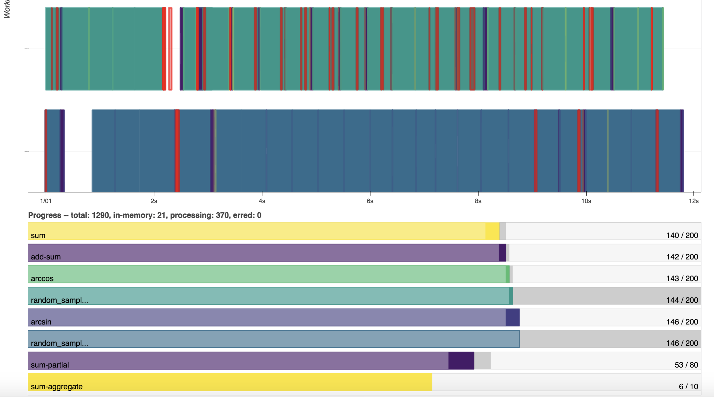
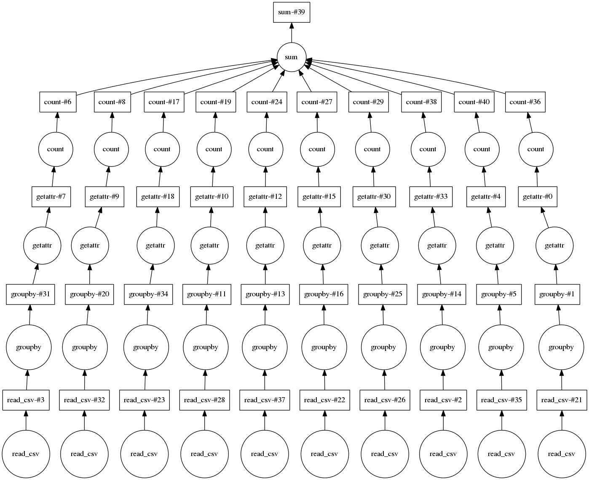
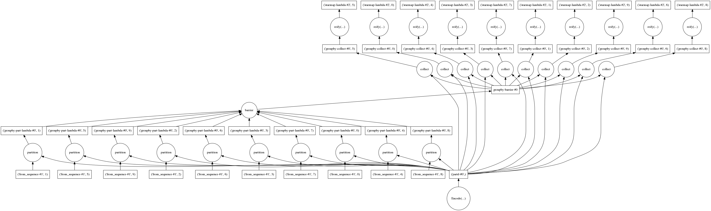

# Dask-Tutorial
flexible parallel computing with Python using Dask

## How-to

```bash
pip install "dask[complete]"
pip install bokeh
```

## Dashboard

You can see every each distributed processes are processing.



## Modules

#### 0.overview

import dask library and do testing hello world.

#### 1.delayed

understand the concept of lazy distributed programming with delayed parameter from dask.



#### 2.bag

understand the concept of dask data structure, called 'bag'.



#### 3.array

understand the concept of dask array, distributed numpy array.
