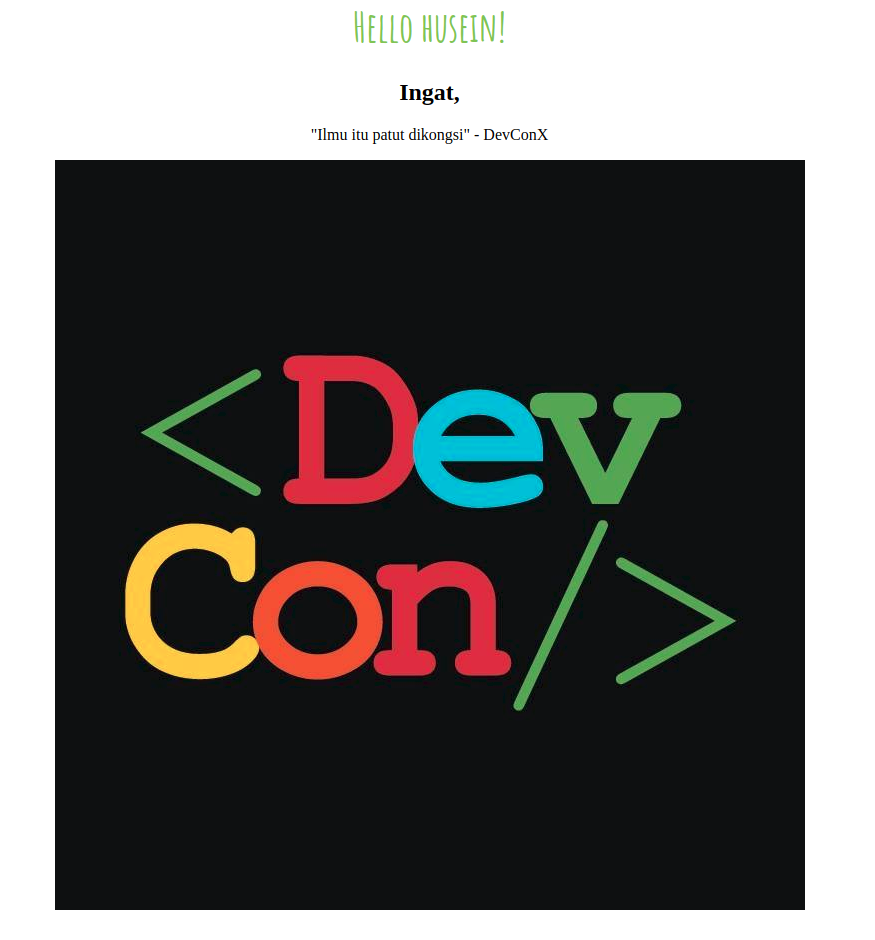
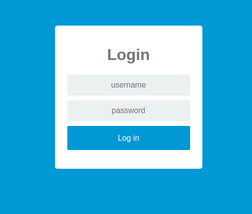

# Python-Flask versi sekolah, with Docker-compose

## How-to install
```bash
pip3 install Flask
```

## Or, How to use docker compose
```bash
cd docker-compose
sudo develop/up
sudo develop/shell # to get inside terminal
```

## Modules

1. Hello World
2. Static routes
3. Dynamic header from dynamic sub-route
4. Beautify (3)
5. Passing variables to HTML
6. login page

## Download link

1. [Click here](https://s3-ap-southeast-1.amazonaws.com/huseinhouse-storage/Python37.zip)
2. [Click here](https://github.com/DevconX/Flask-for-School/raw/master/Python37.zip)

## Results

#### 4. Beautify (3)




#### 5. Passing variables to HTML

```python
quotes = ["Ilmu itu patut dikongsi","Jangan kedekut ilmu","Sentiasalah rendahkan diri","Husein itu comel","Anda sudah pun luar biasa!","Jangan merungut, fikir positif"]
```


#### 6. Login




