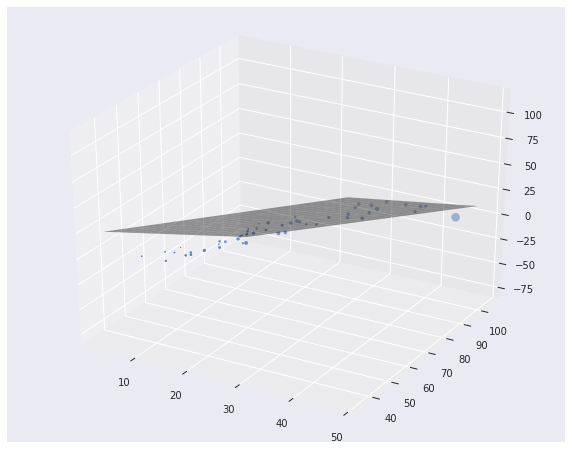
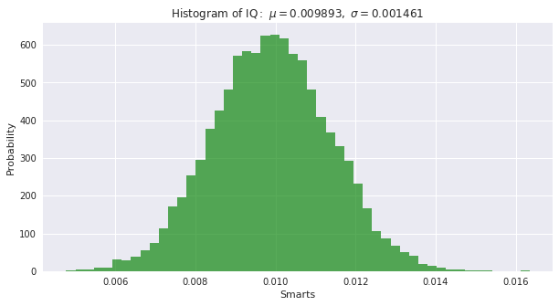

# Statistics-Scratch
implement statistical models from scratch

## Implementation

#### Basic
 1. simple binomial
 2. expected value
 3. chi-square
 4. metric study (mean, median, standard deviation, covariance, correlation)
 5. introduction to probability
 6. conditional probability
 7. independent probability

#### Linear Regression
 1. Least Square (1 feature, 2 features)

#### Value scaling
 1. Min-Max scaling
 2. Standardization
 3. Normalization L1
 4. Normalization L2
 5. Normalization Max
 6. Robust Interquantile

## Discussion

Will update overtime.

## Results

Linear regression 3D

